# MongoDB on Windows
::: warning 
These instructors are for Windows 10, however most things will look the same on Windows 8 and Windows 7.
:::

## Download  

First thing to do is to navigate to so the download page. ([link](https://www.mongodb.com/download-center/community "https://www.mongodb.com/download-center/community")) 

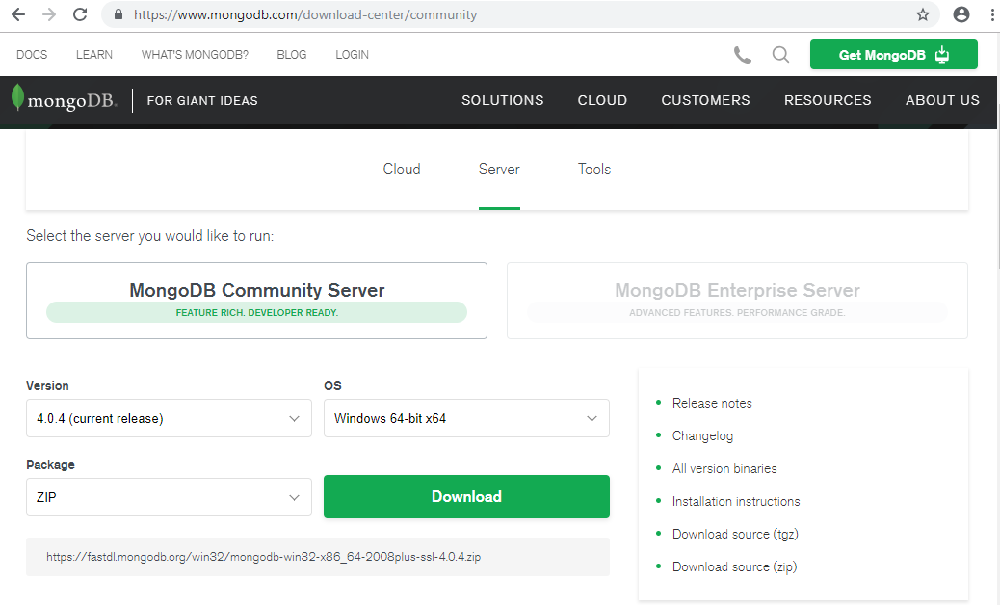

::: tip
The local operating system should already be, and the lastest version of MongoDB should already be selected.
:::

### In the Package dropdown box, select MSI and click download.

### Then click download.

## Installing Mongo

Once the download is completed, go into the folder that you directed the download to, and **double-click the mongodb installer**. 
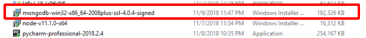

First dialog box on the installer is the welcome screen. Click **Next**. 

Second dialog box will ask which type of installation is desired, Custom or Complete.  If you are already an expert and want to do something different with this installation, click custom, otherwise, choose complete.

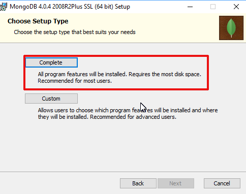

Next, Mongo needs an EULA to be accepted. 

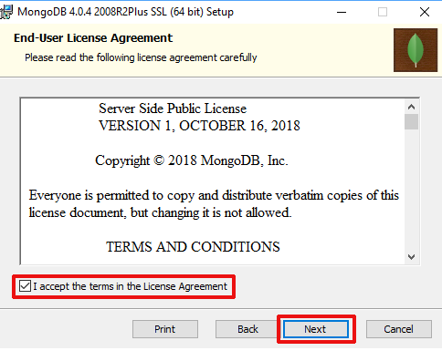

The third dialog box will have a lot of details on where mongo is installed, and where data is to be held. For most students, it is best to leave the default. Click next.

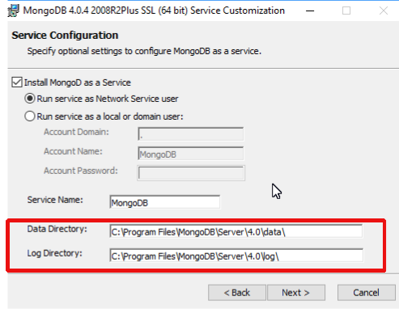

The fourth dialog box will ask if Mongo Compass should be installed. Feel free to choose what is best for your situation, however for the purposes of Teclado courses, this isn't needed.  Uncheck it, and click next. 

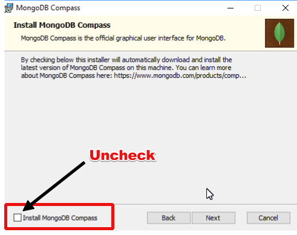

Finally, click install

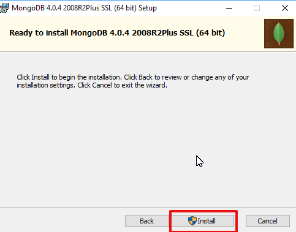

And click finish.   

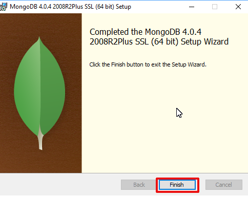

## Setting up Windows
If you open CMD in windows and type in mongo, you will see that mongo doesn't work yet.  This is because the installer doesn't tell Windows where mongo lives in Windows. 

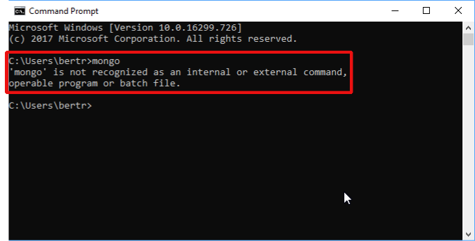

To fix this, using the Window search, look for **environmental variables**

This will open up edit Environmental Variable's properties box.  click once on the **path** property, and then click **edit**.

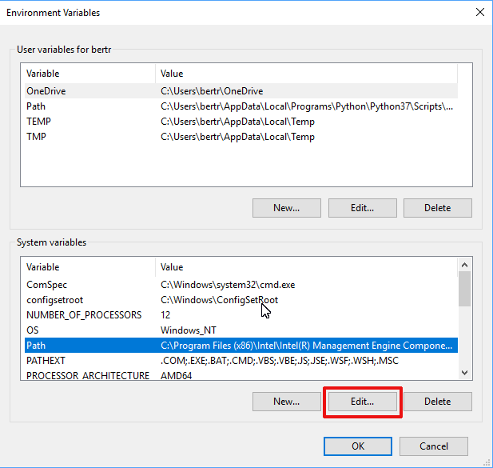

This will bring up the Edit Environmental Variables dialog box.  Click **New**

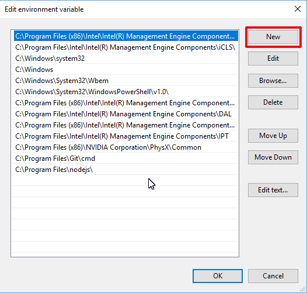

Once new is clicked, a cursor will show up in a new editable row. There you should paste the following:

`C:\Program Files\MongoDB\Server\4.0\bin`

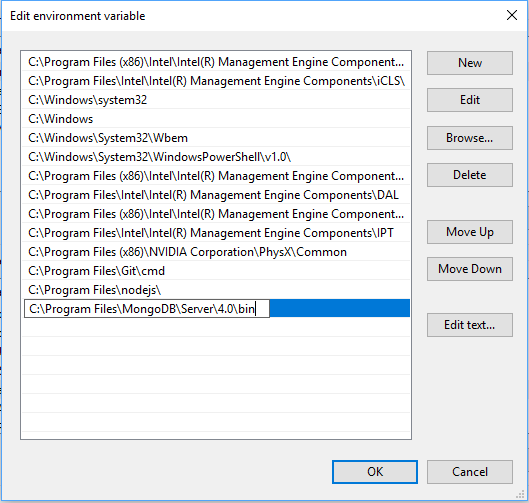

Click Ok, and ok again until all dialog boxes are closed. Then run cmd once more and attempt to execute. Mongo. 

:::tip 
In the course videos,  I run mongod in the terminal.  This is not needed in Windows, as it is installed as a service. 
:::

